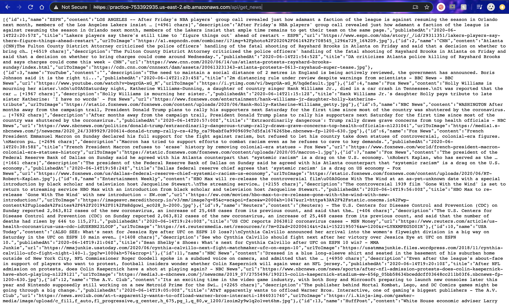
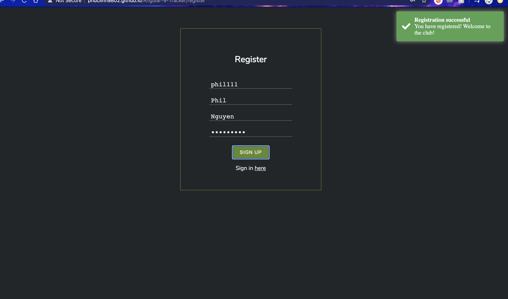

# Covid-19 Tracker and News
- This is a Full-stack personal project which helps users watch, research, and analyze real-time U.S. news data and World's COVID-19 data.
## A. Programming languages, framework, and software used in the project: 
### 1. Back-end:
  - Pycharm 2019.3.3      
  - Python          
  - Microsoft Excel
  - MySQL Workbench 8.0.19                
  - MySQL                     
  - Visual Studio 2019                    
  - C#
### 2. Front-end:
  - Visual Studio Code
  - Angular 9.1.7  
### 3. Testing:
  - Postman
### 4. Deployment:
  - GitHub
  - Nginx/Apache (in process)
  - AWS

## B. Diagram to follow:
### 1. Overview 
  

      
  

   
### 2. Register/Login pages
  

    
  

   
### 3. Dashboard page
  

    
  

  
## C. Instructions on how to access to front-end page
### 1. Since the back-end service page has not installed SSL Certificate yet, you need to enable it by:
  - Access to https://practice-753392935.us-east-2.elb.amazonaws.com/
  - If you are using Google Chrome, from "Advanced" button, choose "proceed to https://practice-753392935.us-east-2.elb.amazonaws.com/"
  - It will not show you anything, so if you want to confirm that the backend is good, go to "https://practice-753392935.us-east-2.elb.amazonaws.com/api/get_news" to see the JSON news content. It should look something like this:
  

    
  

    
### 2. Go to the front-end page:
  - Access to https://phuclinh9802.github.io/Angular-9-Tracker/
  - Here, you should be able to register by clicking on "here". 
  - After done registering, it should look something like this:
  

    
  

  
  - Go back to login page by clicking "here" at the bottom of the form again, and sign in. You should be able to access the page now.
